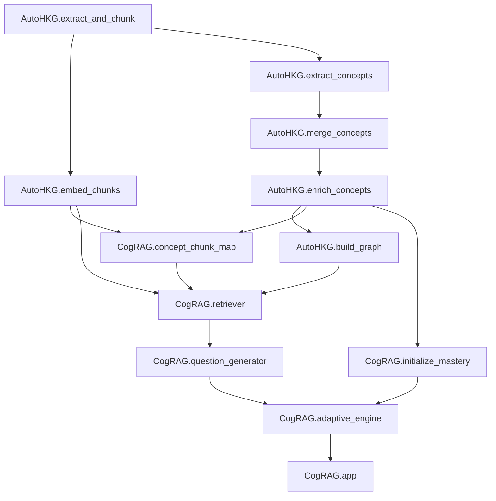

# Adaptive Assessment Engine

## Project Overview
This project is a DBMS-focused adaptive tutoring system. It converts textbook PDFs into a structured concept graph, links concepts back to supporting text chunks, retrieves graph-aware context, generates grounded MCQs, and updates learner mastery with a Bayesian Knowledge Tracing (BKT) loop.

The repository is now split into two top-level packages:

- `AutoHKG`: **Auto Hierarchial Knowledge Graph**. This is the offline knowledge-graph creation pipeline.
- `CogRAG`: **Cognitive RAG**. This is the retrieval, question-generation, adaptive-engine, and app layer.

## Project Structure
```text
.
|-- AutoHKG/
|   |-- __init__.py
|   |-- extract_and_chunk.py
|   |-- embed_chunks.py
|   |-- extract_concepts.py
|   |-- merge_concepts.py
|   |-- enrich_concepts.py
|   |-- build_graph.py
|-- CogRAG/
|   |-- __init__.py
|   |-- concept_chunk_map.py
|   |-- initialize_mastery.py
|   |-- retriever.py
|   |-- question_generator.py
|   |-- adaptive_engine.py
|   |-- app.py
|   |-- llm.py
|   |-- log_file.py
|-- data/
|-- data_halfCorpus/
|-- data_fullCorpus/
|-- graph_model/
|-- test.py
|-- README.md
```

## Installation
No `requirements.txt` or `pyproject.toml` is present, so the package list below is inferred from imports.

### Prerequisites
- Python 3.10+ recommended
- A `books/` directory at the project root containing one or more DBMS PDF files
- Access to the embedding API configured through environment variables
- Access to Azure OpenAI configured through environment variables used by [CogRAG/llm.py](CogRAG/llm.py)

### Required packages
```bash
pip install pymupdf tqdm langchain-text-splitters numpy requests python-dotenv litellm networkx pyvis streamlit
```

### Environment variables
```env
EMBEDDING_API_BASE=http://10.221.0.164:4000/v1
EMBEDDING_MODEL=si-rca-dds-text-embedding-3-small
EMBEDDING_API_KEY=your_token_here
AZURE_OPENAI_ENDPOINT=https://your-resource-name.openai.azure.com/
AZURE_OPENAI_API_KEY=your_azure_openai_api_key_here
AZURE_OPENAI_API_VERSION=2025-01-01-preview
AZURE_OPENAI_MODEL=azure/gpt-4o
```

## Configuration
### Main generated files
- `data/dbms_chunks.json`
- `data/chunk_index.json`
- `data/chunk_embeddings.npy`
- `data/concepts.json`
- `data/merged_concepts.json`
- `data/enriched_concepts.json`
- `graph_model/knowledge_graph.gml`
- `data/knowledge_graph.html`
- `data/concept_chunk_map.json`
- `data/concept_chunk_scores.json`
- `data/mastery_scores.json`
- `data/generated_mcqs.json`
- `data/current_concept.txt`
- `data/recent_concepts.json`

### External services
- OpenAI-compatible embedding API via `requests.post(...)`
- Azure OpenAI via LiteLLM in [CogRAG/llm.py](CogRAG/llm.py)

## Execution Order
The order below is inferred from actual file reads, writes, and imports.

### Workflow 1: AutoHKG
1. **`AutoHKG.extract_and_chunk`**
   - Why first: every later step depends on chunked source text.
   - Produces: `data/dbms_chunks.json`
   - Next step expects: chunk records with IDs and text

2. **`AutoHKG.embed_chunks`**
   - Why here: retrieval and concept mapping need embeddings and a stable chunk index.
   - Produces: `data/chunk_index.json`, `data/chunk_embeddings.npy`
   - Next step expects: embedding rows aligned with chunk metadata

3. **`AutoHKG.extract_concepts`**
   - Why here: concept cleanup starts from raw extracted concepts.
   - Produces: `data/concepts.json`
   - Next step expects: a JSON object with a `concepts` array

4. **`AutoHKG.merge_concepts`**
   - Why here: enrichment should operate on canonical concepts, not noisy raw output.
   - Produces: `data/merged_concepts.json`
   - Next step expects: cleaned concept objects

5. **`AutoHKG.enrich_concepts`**
   - Why here: graph construction needs categories and prerequisites.
   - Produces: `data/enriched_concepts.json`
   - Next step expects: enriched concept records with `parent_concept` and `prerequisites`

6. **`AutoHKG.build_graph`**
   - Why here: this completes the graph-creation stage and produces the graph used by CogRAG.
   - Produces: `graph_model/knowledge_graph.gml`, `data/knowledge_graph.html`
   - Next step expects: the serialized DBMS graph

### Workflow 2: CogRAG preparation
1. **`CogRAG.concept_chunk_map`**
   - Why here: runtime retrieval needs a precomputed concept-to-chunk candidate map.
   - Produces: `data/concept_chunk_map.json`, `data/concept_chunk_scores.json`
   - Next step expects: concept-keyed candidate chunk IDs and similarity scores

2. **`CogRAG.initialize_mastery`**
   - Why here: adaptive tutoring needs initial learner mastery state.
   - Produces: `data/mastery_scores.json`
   - Next step expects: per-concept BKT state

### Workflow 3: Runtime tutoring
1. **`CogRAG.retriever`**
   - Why here: question generation first retrieves graph-aware context.
   - Produces: in-memory retrieval results
   - Next step expects: concept context, chunk IDs, and similarity scores

2. **`CogRAG.question_generator`**
   - Why here: the adaptive engine needs a grounded question to ask.
   - Produces: `data/generated_mcqs.json` and an in-memory question object
   - Next step expects: a valid MCQ with answer and source chunk

3. **`CogRAG.adaptive_engine`**
   - Why here: it selects concepts, chooses difficulty, and updates mastery from answers.
   - Produces: updated mastery and runtime tracking files
   - Next step expects: adaptive question state for the UI

4. **`CogRAG.app`**
   - Why here: this is the user-facing Streamlit application.
   - Produces: interactive tutoring UI

## Workflow Diagram


## Main Entry Points
- AutoHKG build pipeline: `python -m AutoHKG.extract_and_chunk` through `python -m AutoHKG.build_graph`
- CogRAG preparation: `python -m CogRAG.concept_chunk_map`, `python -m CogRAG.initialize_mastery`
- Interactive app: `streamlit run CogRAG/app.py`

## Common Workflows
### Full pipeline
```bash
python -m AutoHKG.extract_and_chunk
python -m AutoHKG.embed_chunks
python -m AutoHKG.extract_concepts
python -m AutoHKG.merge_concepts
python -m AutoHKG.enrich_concepts
python -m AutoHKG.build_graph
python -m CogRAG.concept_chunk_map
python -m CogRAG.initialize_mastery
streamlit run CogRAG/app.py
```

### AutoHKG only
```bash
python -m AutoHKG.extract_and_chunk
python -m AutoHKG.embed_chunks
python -m AutoHKG.extract_concepts
python -m AutoHKG.merge_concepts
python -m AutoHKG.enrich_concepts
python -m AutoHKG.build_graph
```

### Retrieval prep
```bash
python -m CogRAG.concept_chunk_map
python -m CogRAG.initialize_mastery
```

### Retrieval
```bash
python -m CogRAG.retriever "Normalization"
```

### Question generation
```bash
python -m CogRAG.question_generator "Normalization" medium
```

### App
```bash
streamlit run CogRAG/app.py
```

## Script Reference
Each executable script is documented once below.

### `AutoHKG/extract_and_chunk.py`
- **Purpose:** Extracts text from PDFs in `books/`, cleans it, chunks it, and saves the chunk corpus.
- **Inputs:** `books/*.pdf`
- **Outputs:** `data/dbms_chunks.json`
- **Dependencies:** None
- **Side effects:** Creates `data/`
- **Required or optional:** Required
- **Example usage:** `python -m AutoHKG.extract_and_chunk`

### `AutoHKG/embed_chunks.py`
- **Purpose:** Calls the embedding API for chunk text and saves chunk embeddings plus chunk metadata order.
- **Inputs:** `data/dbms_chunks.json`, `EMBEDDING_*`
- **Outputs:** `data/chunk_index.json`, `data/chunk_embeddings.npy`
- **Dependencies:** `AutoHKG/extract_and_chunk.py`
- **Side effects:** Network calls to the embedding API
- **Required or optional:** Required
- **Example usage:** `python -m AutoHKG.embed_chunks`

### `AutoHKG/extract_concepts.py`
- **Purpose:** Uses the LLM to extract important DBMS concepts from chunk batches.
- **Inputs:** `data/dbms_chunks.json`, [CogRAG/llm.py](/d:/TCS%20R&I%20Internship/Adaptive-Assessment-Engine/CogRAG/llm.py:1)
- **Outputs:** `data/concepts.json`
- **Dependencies:** `AutoHKG/extract_and_chunk.py`
- **Side effects:** LLM calls and log writes
- **Required or optional:** Required
- **Example usage:** `python -m AutoHKG.extract_concepts`

### `AutoHKG/merge_concepts.py`
- **Purpose:** Cleans, filters, and canonicalizes extracted concepts.
- **Inputs:** `data/concepts.json`, [CogRAG/llm.py](/d:/TCS%20R&I%20Internship/Adaptive-Assessment-Engine/CogRAG/llm.py:1)
- **Outputs:** `data/merged_concepts.json`
- **Dependencies:** `AutoHKG/extract_concepts.py`
- **Side effects:** LLM calls and log writes
- **Required or optional:** Required
- **Example usage:** `python -m AutoHKG.merge_concepts`

### `AutoHKG/enrich_concepts.py`
- **Purpose:** Adds category and prerequisite relationships to each concept.
- **Inputs:** `data/merged_concepts.json`, [CogRAG/llm.py](/d:/TCS%20R&I%20Internship/Adaptive-Assessment-Engine/CogRAG/llm.py:1)
- **Outputs:** `data/enriched_concepts.json`
- **Dependencies:** `AutoHKG/merge_concepts.py`
- **Side effects:** LLM calls and log writes
- **Required or optional:** Required
- **Example usage:** `python -m AutoHKG.enrich_concepts`

### `AutoHKG/build_graph.py`
- **Purpose:** Builds the DBMS knowledge graph and writes both GML and HTML visualization outputs.
- **Inputs:** `data/enriched_concepts.json`
- **Outputs:** `graph_model/knowledge_graph.gml`, `data/knowledge_graph.html`
- **Dependencies:** `AutoHKG/enrich_concepts.py`
- **Side effects:** Creates `graph_model/` and `data/`
- **Required or optional:** Required
- **Example usage:** `python -m AutoHKG.build_graph`

### `CogRAG/concept_chunk_map.py`
- **Purpose:** Precomputes semantic chunk candidates for each concept.
- **Inputs:** `data/dbms_chunks.json`, `data/enriched_concepts.json`, `data/chunk_index.json`, `data/chunk_embeddings.npy`, `EMBEDDING_*`
- **Outputs:** `data/concept_chunk_map.json`, `data/concept_chunk_scores.json`
- **Dependencies:** `AutoHKG/embed_chunks.py`, `AutoHKG/enrich_concepts.py`
- **Side effects:** Network calls to the embedding API
- **Required or optional:** Required for runtime retrieval
- **Example usage:** `python -m CogRAG.concept_chunk_map`

### `CogRAG/initialize_mastery.py`
- **Purpose:** Creates the initial BKT mastery state for every concept.
- **Inputs:** `data/enriched_concepts.json`
- **Outputs:** `data/mastery_scores.json`
- **Dependencies:** `AutoHKG/enrich_concepts.py`
- **Side effects:** Overwrites mastery state if rerun
- **Required or optional:** Required before adaptive tutoring
- **Example usage:** `python -m CogRAG.initialize_mastery`

### `CogRAG/retriever.py`
- **Purpose:** Combines graph relationships with semantic reranking to retrieve concept-grounded context.
- **Inputs:** concept CLI argument, `graph_model/knowledge_graph.gml`, `data/concept_chunk_map.json`, `data/dbms_chunks.json`, `data/chunk_index.json`, `data/chunk_embeddings.npy`, `EMBEDDING_*`
- **Outputs:** console output when used as a CLI tool; in-memory retrieval result when imported
- **Dependencies:** `AutoHKG/build_graph.py`, `CogRAG/concept_chunk_map.py`, `AutoHKG/embed_chunks.py`
- **Side effects:** Network calls to the embedding API
- **Required or optional:** Optional standalone tool, required indirectly by question generation
- **Example usage:** `python -m CogRAG.retriever "Normalization"`

### `CogRAG/question_generator.py`
- **Purpose:** Retrieves context, prompts the LLM to generate an MCQ, validates it, and stores accepted questions.
- **Inputs:** concept and difficulty CLI arguments, `CogRAG/retriever.py`, [CogRAG/llm.py](/d:/TCS%20R&I%20Internship/Adaptive-Assessment-Engine/CogRAG/llm.py:1), `EMBEDDING_*`
- **Outputs:** `data/generated_mcqs.json`
- **Dependencies:** `CogRAG/retriever.py`
- **Side effects:** LLM calls, embedding API calls, and question-bank updates
- **Required or optional:** Optional standalone tool, required indirectly by the adaptive engine
- **Example usage:** `python -m CogRAG.question_generator "Normalization" medium`

### `CogRAG/adaptive_engine.py`
- **Purpose:** Selects the next concept, decides difficulty, evaluates answers, and updates BKT mastery state.
- **Inputs:** `data/mastery_scores.json`, `graph_model/knowledge_graph.gml`, `data/current_concept.txt`, `data/recent_concepts.json`, question objects from `CogRAG/question_generator.py`
- **Outputs:** updated `data/mastery_scores.json`, `data/current_concept.txt`, `data/recent_concepts.json`
- **Dependencies:** `CogRAG/initialize_mastery.py`, `AutoHKG/build_graph.py`, `CogRAG/question_generator.py`
- **Side effects:** Mutates learner-state files
- **Required or optional:** Required for adaptive tutoring, optional if only building assets
- **Example usage:** imported by `CogRAG/app.py`

### `CogRAG/app.py`
- **Purpose:** Streamlit UI for generating adaptive questions, submitting answers, and showing progress.
- **Inputs:** Streamlit runtime plus all prerequisite offline assets
- **Outputs:** browser UI and indirect learner-state updates
- **Dependencies:** full AutoHKG pipeline plus `CogRAG/adaptive_engine.py`
- **Side effects:** session-state changes and indirect file updates
- **Required or optional:** Optional if you only need offline artifacts; main user entry point
- **Example usage:** `streamlit run CogRAG/app.py`

### `test.py`
- **Purpose:** Minimal diagnostic script that prints the shape of `data/chunk_embeddings.npy`.
- **Inputs:** `data/chunk_embeddings.npy`
- **Outputs:** console output only
- **Dependencies:** `AutoHKG/embed_chunks.py`
- **Side effects:** None
- **Required or optional:** Optional utility
- **Example usage:** `python test.py`

## Troubleshooting
### Missing `books/` input
`AutoHKG/extract_and_chunk.py` expects a root-level `books/` directory containing PDFs.

### Missing generated assets
Run the pipeline in order before using `CogRAG.retriever`, `CogRAG.question_generator`, or `CogRAG.app`.

### Embedding API errors
Check:
- `EMBEDDING_API_BASE`
- `EMBEDDING_MODEL`
- `EMBEDDING_API_KEY`
- connectivity to the configured endpoint

### LLM failures
[CogRAG/llm.py](CogRAG/llm.py) reads its Azure OpenAI settings from environment variables. If those values are missing or invalid, concept extraction, enrichment, and question generation will fail.

## Assumptions
- The intended input corpus is DBMS textbook material because every prompt and the app title are DBMS-specific.
- `AutoHKG.build_graph` is the end of the knowledge-graph creation phase, and `CogRAG.*` is the retrieval and tutoring phase. This grouping is based on actual file responsibilities and imports.
- Module-style commands such as `python -m AutoHKG.extract_concepts` are the safest way to run the renamed code because the packages now import each other by package name.

## Missing or Unused Code
- [AutoHKG/build_graph.py](/d:/TCS%20R&I%20Internship/Adaptive-Assessment-Engine/AutoHKG/build_graph.py:1) still executes at import time because it uses top-level graph-building code instead of a guarded `main()` wrapper.
- `test.py` is not referenced by other scripts and appears to be a one-off diagnostic utility.
- `data/enrichment_stats.json` reports a high prerequisite-cycle count, which suggests the enriched prerequisite graph may contain many cycles.

## Potential Improvements
- Add `requirements.txt` or `pyproject.toml`
- Move hardcoded Azure credentials in `CogRAG/llm.py` into environment variables
- Wrap `AutoHKG/build_graph.py` in a `main()` function
- Add an orchestrator script for the full pipeline
- Add stronger validation for prerequisite cycles in the enriched graph
- Expand automated tests beyond `test.py`
